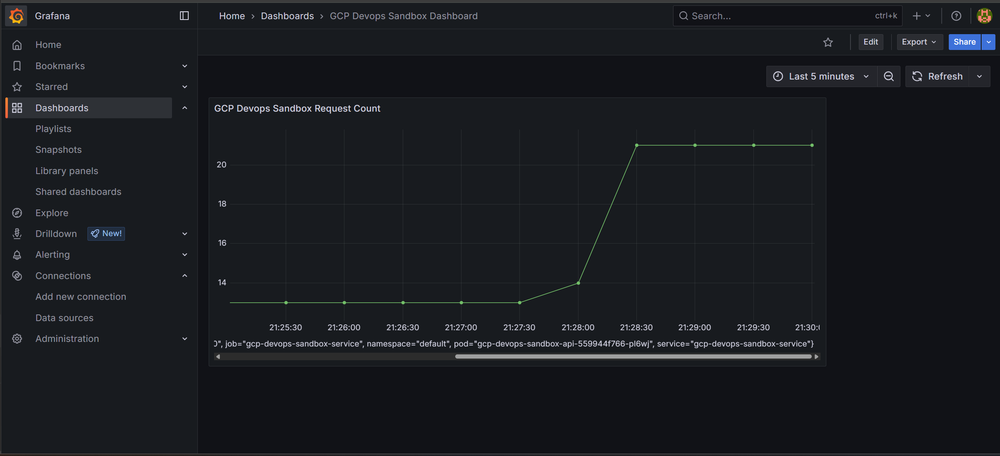

# GCP DevOps Sandbox

A self-contained sandbox application built with FastAPI, designed to demonstrate modern DevOps workflows, including:

- Containerization with Docker
- Deployment to Google Cloud Platform (GCP)
- Prometheus-style metrics exposure
- CI/CD integration readiness

## Project Overview

The GCP DevOps Sandbox is a personal DevOps training project aimed at demonstrating familiarity with common tools and practices used in Platform Engineering. The goal is to simulate a realistic DevOps environment using:

- CI/CD (Jenkins)
- Monitoring (Prometheus + Grafana)
- Infrastructure as Code (Terraform)
- Cloud deployment (GCP App Engine)

## Features

* FastAPI: Minimal modern Python framework for rapid API development
* Dockerized: Lightweight docker container setup
* GCP App Engine: Deployable with a single gcloud command
* /metrics Route: Provides Prometheus-style metrics
* Health Check Route: / response with status and version information


## Quickstart

### Run Locally

```bash

# Clone the repository
git clone https://github.com/DrewGB/gcp-devops-sandbox.git
cd gcp-devops-sandbox

# Create a virtual environment
python -m venv .venv
source .venv/bin/activate   # or .venv\Scripts\activate on Windows

# Install dependencies
pip install -r requirements.txt

# Run the API
uvicorn app.main:app --reload

```

### Run with Docker

```bash
# Build container
docker build -t gcp-devops-sandbox .

# Run the container
docker run -d -p 8000:8000 --name gcp-devops-sandbox-api gcp-devops-sandbox

```

### Deploy via App Engine

```bash
    
gcloud app deploy
    
```

## CI/CD with Jenkins

This project includes a Jenkinsfile pipeline for automated deployment via minikube. Jenkins was installed into a jenkins namespace via helm and run locally. The pipeline includes:

* Installing dependencies
* Building docker container
* Deploying to minikube

## Monitoring done with Prometheus and Grafana

Prometheus counters were added to the FastAPI in order to track metrics across all routes. 
Prometheus and Grafana were installed via helm to a monitoring namespace in minikube, and a service monitor
was created in order for prometheus to scrape the /metrics endpoint.

Metrics are viewed in a custom grafana dashboard. Below is a snapshot showing all http requests sent to the FastAPI app.

